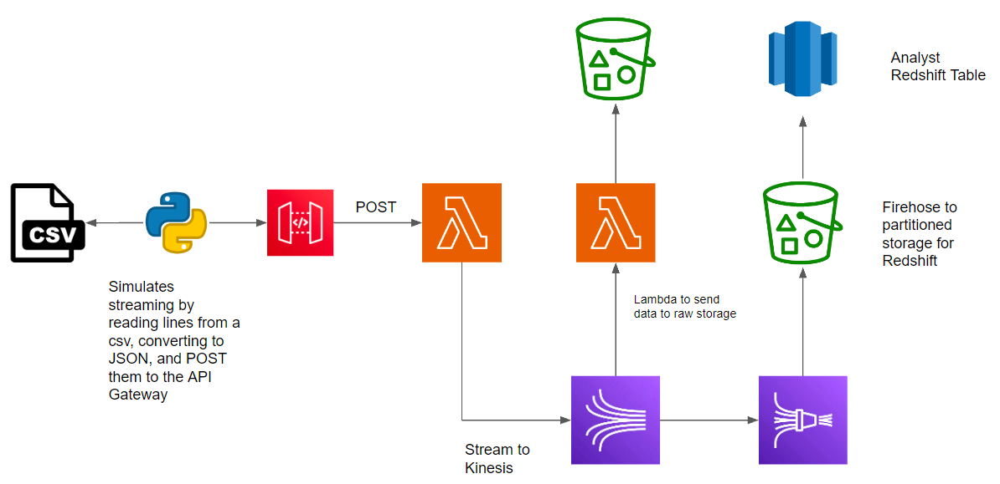

# Overview 
The goal of this project is to learn how to use a variety of AWS services, specifically AWS Lambdas. This project is mostly hosted on AWS using their services, besides converting each row of a .csv to a json string and posting it to the gateway API. I have provided the Lambda code, but most of the work for the project is setting up each service. 

## Pipelines 
Composed of the:

    1. Data Ingestion Pipeline
        1. Simulated data stream by posting individual records from a .csv file as JSON strings into the AWS API gatewayu
    2. Stream to S3 Pipeline 
        1. Raw data sink for backup, other data products 
        2. Data inserted into Kinesis Data Stream -> Lambda Triggers -> Inserted into S3 Bucket 
        3. Lambda is configured to read data for a time increment to limit the # of files written into the bucket 
    3. Redshift DWH pipeline 
        1. Data is taken from the Kinesis Data Stream and pushed to the Kinesis Delivery Stream
        2. Each record is inserted into a Redshift Table for analysis
